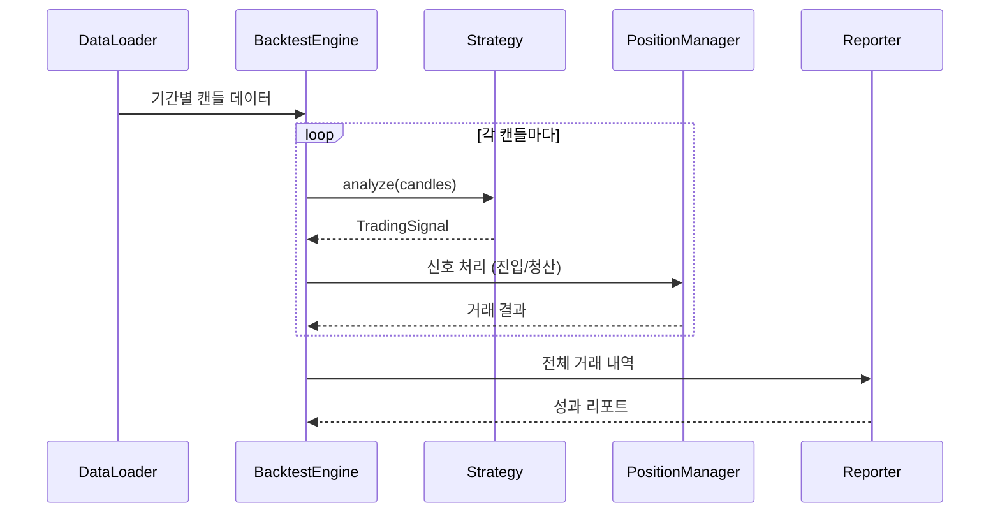

# 백테스트 시스템 설계 (Backtesting)

## 개요 (Overview)

백테스트(Backtesting)는 **과거 시장 데이터**를 사용하여 트레이딩 전략의 성과를 검증하는 시스템입니다. 특정 기간의 히스토리 데이터로 전략을 시뮬레이션하여 수익률, 최대 낙폭(MDD), 승률 등의 지표를 산출합니다.

### 목표

1. **전략 최적화**: 파라미터 조정을 통한 전략 성능 향상
2. **리스크 평가**: 최대 손실 시나리오 파악
3. **비교 분석**: 여러 전략 간 성과 비교

---

## 아키텍처 (Architecture)

### 컴포넌트 다이어그램

```mermaid
graph LR
    subgraph "백테스트 시스템"
        A[HistoricalDataLoader] -->|Candle[]| B(BacktestEngine)
        B -->|각 캔들 처리| C[Strategy]
        C -->|TradingSignal| B
        B -->|신호 처리| D[BacktestPositionManager]
        D -->|거래 기록| E[BacktestReporter]
        E -->|결과 출력| F[(Report File)]
    end
```

### 데이터 흐름



---

## 환경 구성 (Environment Configuration)

### 환경 변수

```bash
# 백테스트 설정
BACKTEST_SYMBOL=BTCUSDT
BACKTEST_INTERVAL=15m
BACKTEST_START_DATE=2024-01-01
BACKTEST_END_DATE=2024-12-01

# 초기 자본
BACKTEST_INITIAL_CAPITAL=10000

# 리스크 설정 (선택적, 기본값 사용 가능)
BACKTEST_RISK_PER_TRADE=1
BACKTEST_MAX_LEVERAGE=5
```

---

## 데이터 구조 (Data Structures)

### BacktestConfig

백테스트 실행 설정입니다.

```typescript
export interface BacktestConfig {
  symbol: string;
  interval: string;
  startDate: Date;
  endDate: Date;
  initialCapital: number;
  riskPerTradePercent?: number;
  maxLeverage?: number;
  slippagePercent?: number;
  feePercent?: number;
}
```

### BacktestTrade

백테스트 중 발생한 개별 거래 기록입니다.

```typescript
export interface BacktestTrade {
  id: number;
  symbol: string;
  side: 'LONG' | 'SHORT';
  entryTime: Date;
  entryPrice: number;
  exitTime: Date;
  exitPrice: number;
  quantity: number;
  pnl: number;
  pnlPercent: number;
  reason: string;
  cumulativeBalance: number;
}
```

### BacktestResult

백테스트 최종 결과 요약입니다.

```typescript
export interface BacktestResult {
  config: BacktestConfig;
  trades: BacktestTrade[];
  metrics: BacktestMetrics;
  equityCurve: EquityPoint[];
}

export interface BacktestMetrics {
  totalTrades: number;
  winningTrades: number;
  losingTrades: number;
  winRate: number;

  totalPnl: number;
  totalPnlPercent: number;

  averageWin: number;
  averageLoss: number;
  profitFactor: number;

  maxDrawdown: number;
  maxDrawdownPercent: number;

  sharpeRatio?: number;
  calmarRatio?: number;
}

export interface EquityPoint {
  timestamp: Date;
  balance: number;
  drawdownPercent: number;
}
```

---

## 인터페이스 정의 (Interfaces)

### HistoricalDataLoader

과거 캔들 데이터를 로드하는 인터페이스입니다.

```typescript
export interface HistoricalDataLoader {
  /**
   * 지정된 기간의 캔들 데이터를 로드합니다.
   */
  loadCandles(
    symbol: string,
    interval: string,
    startDate: Date,
    endDate: Date,
  ): Promise<Candle[]>;
}
```

### BacktestEngine

백테스트 실행 엔진입니다.

```typescript
export interface BacktestEngine {
  /**
   * 백테스트를 실행하고 결과를 반환합니다.
   */
  run(config: BacktestConfig, strategy: TradeStrategy): Promise<BacktestResult>;
}
```

---

## 모듈 구조 (Module Structure)

### 디렉토리 구조

```text
📂 src/backtest
├── 📂 domain
│   ├── backtest.config.ts
│   ├── backtest.trade.ts
│   ├── backtest.result.ts
│   └── backtest.metrics.ts
├── 📂 application
│   ├── backtest.engine.ts
│   ├── backtest.engine.spec.ts
│   ├── backtest.position.manager.ts
│   └── backtest.reporter.ts
├── 📂 infrastructure
│   ├── binance.historical.loader.ts
│   └── binance.historical.loader.spec.ts
└── backtest.module.ts
```

---

## 히스토리 데이터 수집 (Historical Data Collection)

### Binance API 사용

Binance REST API의 `/fapi/v1/klines` 엔드포인트를 사용하여 과거 데이터를 수집합니다.

```typescript
// BinanceHistoricalLoader 구현 예시
async loadCandles(
  symbol: string,
  interval: string,
  startDate: Date,
  endDate: Date
): Promise<Candle[]> {
  const allCandles: Candle[] = [];
  let currentStart = startDate.getTime();
  const endTime = endDate.getTime();

  while (currentStart < endTime) {
    const response = await this.client.getKlines({
      symbol,
      interval,
      startTime: currentStart,
      endTime,
      limit: 1000, // Binance 최대 limit
    });

    const candles = response.map(this.mapToCandle);
    allCandles.push(...candles);

    if (response.length < 1000) break;
    currentStart = response[response.length - 1][6] + 1; // 다음 시작 시간
  }

  return allCandles;
}
```

### 데이터 캐싱

대량의 데이터를 반복 요청하지 않도록 로컬 캐싱을 지원합니다.

```text
📂 data/cache
└── btcusdt_15m_2024-01-01_2024-12-01.json
```

---

## 실행 엔진 (Backtest Engine)

### 핵심 로직

```typescript
export class SimpleBacktestEngine implements BacktestEngine {
  async run(
    config: BacktestConfig,
    strategy: TradeStrategy,
  ): Promise<BacktestResult> {
    // 1. 데이터 로드
    const candles = await this.dataLoader.loadCandles(
      config.symbol,
      config.interval,
      config.startDate,
      config.endDate,
    );

    // 2. 전략 초기화
    await strategy.onInit?.();

    // 3. 각 캔들 순회하며 시뮬레이션
    const trades: BacktestTrade[] = [];
    let balance = config.initialCapital;
    let position: BacktestPosition | null = null;

    for (let i = 50; i < candles.length; i++) {
      // 50개는 지표 계산용 버퍼
      const windowCandles = candles.slice(0, i + 1);
      const currentCandle = candles[i];

      // 전략 분석
      const signal = await strategy.analyze(windowCandles);

      // 신호 처리
      if (signal.action === TradingAction.EnterLong && !position) {
        position = this.openPosition(
          'LONG',
          currentCandle.close,
          balance,
          config,
        );
      } else if (signal.action === TradingAction.ExitLong && position) {
        const trade = this.closePosition(
          position,
          currentCandle,
          'Signal Exit',
        );
        trades.push(trade);
        balance = trade.cumulativeBalance;
        position = null;
      }
      // Short 처리 로직도 동일하게 구현
    }

    // 4. 결과 집계
    return this.generateResult(config, trades, balance);
  }
}
```

---

## 성과 지표 계산 (Metrics Calculation)

### 주요 지표

| 지표                | 설명                | 계산 방법                                                |
| ------------------- | ------------------- | -------------------------------------------------------- |
| **승률 (Win Rate)** | 수익 거래 비율      | `winningTrades / totalTrades * 100`                      |
| **총 수익률**       | 초기 자본 대비 수익 | `(finalBalance - initialCapital) / initialCapital * 100` |
| **최대 낙폭 (MDD)** | 고점 대비 최대 하락 | `max((peak - trough) / peak * 100)`                      |
| **수익 팩터**       | 총 이익 / 총 손실   | `sum(wins) / abs(sum(losses))`                           |
| **샤프 비율**       | 위험 조정 수익률    | `(avgReturn - riskFreeRate) / stdDev`                    |

### MDD 계산 예시

```typescript
function calculateMaxDrawdown(equityCurve: EquityPoint[]): number {
  let peak = equityCurve[0].balance;
  let maxDrawdown = 0;

  for (const point of equityCurve) {
    if (point.balance > peak) {
      peak = point.balance;
    }
    const drawdown = ((peak - point.balance) / peak) * 100;
    if (drawdown > maxDrawdown) {
      maxDrawdown = drawdown;
    }
  }

  return maxDrawdown;
}
```

---

## 테스트 전략 (Testing Strategy)

### 단위 테스트 (Jest)

```typescript
describe('BacktestEngine', () => {
  it('should execute trades based on strategy signals', () => {});
  it('should calculate PnL correctly including fees', () => {});
  it('should track equity curve accurately', () => {});
  it('should handle edge cases (no trades, all wins, all losses)', () => {});
});

describe('BacktestMetrics', () => {
  it('should calculate win rate correctly', () => {});
  it('should calculate max drawdown correctly', () => {});
  it('should calculate profit factor correctly', () => {});
});

describe('BinanceHistoricalLoader', () => {
  it('should fetch candles for given date range', () => {});
  it('should handle pagination for large date ranges', () => {});
  it('should cache data to avoid repeated API calls', () => {});
});
```

---

## 실행 방법 (How to Run)

### CLI 스크립트

`scripts/backtest.ts` 생성:

```typescript
import { NestFactory } from '@nestjs/core';
import { BacktestModule } from '../src/backtest/backtest.module';

async function bootstrap() {
  const app = await NestFactory.createApplicationContext(BacktestModule);

  const engine = app.get('BacktestEngine');
  const strategy = app.get('MacdRsiStrategy');

  const config: BacktestConfig = {
    symbol: process.env.BACKTEST_SYMBOL || 'BTCUSDT',
    interval: process.env.BACKTEST_INTERVAL || '15m',
    startDate: new Date(process.env.BACKTEST_START_DATE || '2024-01-01'),
    endDate: new Date(process.env.BACKTEST_END_DATE || '2024-12-01'),
    initialCapital: Number(process.env.BACKTEST_INITIAL_CAPITAL) || 10000,
  };

  const result = await engine.run(config, strategy);

  console.log('=== Backtest Result ===');
  console.log(`Total Trades: ${result.metrics.totalTrades}`);
  console.log(`Win Rate: ${result.metrics.winRate.toFixed(2)}%`);
  console.log(
    `Total PnL: $${result.metrics.totalPnl.toFixed(2)} (${result.metrics.totalPnlPercent.toFixed(2)}%)`,
  );
  console.log(`Max Drawdown: ${result.metrics.maxDrawdownPercent.toFixed(2)}%`);
  console.log(`Profit Factor: ${result.metrics.profitFactor.toFixed(2)}`);

  await app.close();
}

bootstrap();
```

### package.json 스크립트

```json
{
  "scripts": {
    "backtest": "ts-node scripts/backtest.ts",
    "backtest:btc": "BACKTEST_SYMBOL=BTCUSDT ts-node scripts/backtest.ts",
    "backtest:eth": "BACKTEST_SYMBOL=ETHUSDT ts-node scripts/backtest.ts"
  }
}
```

### 실행 예시

```bash
# 기본 백테스트 실행
pnpm run backtest

# 환경변수로 설정
BACKTEST_START_DATE=2024-06-01 BACKTEST_END_DATE=2024-12-01 pnpm run backtest
```

---

## 리포트 출력 (Report Output)

### 콘솔 출력

```text
╔════════════════════════════════════════════════════════════╗
║                   BACKTEST REPORT                          ║
║                 BTCUSDT | 15m | 2024                       ║
╠════════════════════════════════════════════════════════════╣
║  Period: 2024-01-01 ~ 2024-12-01 (335 days)               ║
║  Initial Capital: $10,000.00                               ║
║  Final Capital: $14,523.45                                 ║
╠════════════════════════════════════════════════════════════╣
║  📊 PERFORMANCE                                            ║
║  ────────────────────────────────────────────────────────  ║
║  Total Return: +45.23%                                     ║
║  Total Trades: 87                                          ║
║  Win Rate: 58.62%                                          ║
║  Profit Factor: 1.82                                       ║
╠════════════════════════════════════════════════════════════╣
║  ⚠️  RISK                                                  ║
║  ────────────────────────────────────────────────────────  ║
║  Max Drawdown: -12.34%                                     ║
║  Longest Losing Streak: 5 trades                           ║
║  Sharpe Ratio: 1.45                                        ║
╚════════════════════════════════════════════════════════════╝
```

### JSON 파일 출력

```typescript
// 결과를 JSON으로 저장
import { writeFileSync } from 'fs';

const outputPath = `reports/backtest_${config.symbol}_${Date.now()}.json`;
writeFileSync(outputPath, JSON.stringify(result, null, 2));
```

---

## 시각화 (Visualization)

### Equity Curve 차트 (향후 확장)

CSV 출력을 통해 외부 도구(Excel, Python matplotlib 등)에서 시각화 가능:

```typescript
function exportEquityCurveToCsv(curve: EquityPoint[], path: string) {
  const header = 'timestamp,balance,drawdown\n';
  const rows = curve
    .map(
      (p) => `${p.timestamp.toISOString()},${p.balance},${p.drawdownPercent}`,
    )
    .join('\n');

  writeFileSync(path, header + rows);
}
```

---

## 구현 우선순위

1. **[P0]** DTO 정의: `BacktestConfig`, `BacktestTrade`, `BacktestResult`, `BacktestMetrics`
2. **[P0]** `BinanceHistoricalLoader` 구현 (API로 과거 데이터 수집)
3. **[P0]** `SimpleBacktestEngine` 구현 (핵심 시뮬레이션 로직)
4. **[P1]** 성과 지표 계산 로직 (`calculateMetrics`)
5. **[P1]** CLI 스크립트 생성 (`scripts/backtest.ts`)
6. **[P2]** 데이터 캐싱 레이어
7. **[P2]** 리포트 포맷터 (콘솔 + JSON + CSV)
