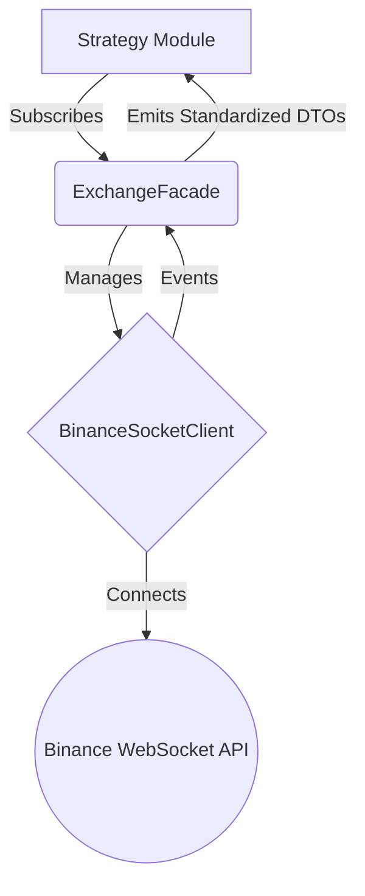

# Exchange Module Design

## Overview

The `exchange` module acts as the bridge between the trading bot and external crypto exchanges. This document outlines the design for integrating **Binance Perpetual Futures** (USDT-M), specifically focusing on real-time data acquisition via WebSocket.

## Architecture

The architecture separates the low-level connection management from the high-level data consumption. We strictly follow the Clean Code principles, using specific DTOs instead of `any`.

### conceptual Component Diagram



## Data Structures (DTOs)

Interfaces/Types must be explicit. We avoid `any` to ensure type safety and clarity.

### Candle (OHLCV)

Represents a standard candlestick for a specific interval.

```typescript
export interface Candle {
  symbol: string; // e.g., 'BTCUSDT'
  interval: string; // e.g., '1m', '15m'
  openTime: number; // Timestamp in ms
  open: number;
  high: number;
  low: number;
  close: number;
  volume: number;
  closeTime: number; // Timestamp in ms
  isFinal: boolean; // True if the candle is closed
}
```

### MarketTicker

Represents the current market state (Best bid/ask or last price).

```typescript
export interface MarketTicker {
  symbol: string;
  price: number;
  timestamp: number;
}
```

## Interface Definitions

The `MarketStream` interface abstracts the WebSocket complexity.

```typescript
import { Observable } from 'rxjs';

export interface MarketStream {
  /**
   * Establish connection to the exchange's websocket feed.
   */
  connect(): Promise<void>;

  /**
   * Disconnect the stream.
   */
  disconnect(): Promise<void>;

  /**
   * Subscribe to specific market data streams.
   * Returns a standard Observable for reactive processing.
   */
  getRealtimeCandles(symbol: string, interval: string): Observable<Candle>;

  /**
   * Get real-time price updates (.e.g mark price).
   */
  getRealtimeTicker(symbol: string): Observable<MarketTicker>;
}
```

## Implementation Strategy: Binance Perpetual Futures

### WebSocket Endpoint

- **Base URL**: `wss://fstream.binance.com/ws`
- **Docs**: [Binance Futures WebSocket API](https://binance-docs.github.io/apidocs/future/en/#websocket-market-streams)

### Connection Management (`BinanceSocketClient`)

This class handles the raw WebSocket connection, including:

1.  **Connection Lifecycle**: `open`, `close`, `error` handling.
2.  **Heartbeat**: Responding to PING frames with PONG (if application level) or ensuring transport level keep-alive.
3.  **Automatic Reconnection**: Using exponential backoff implementation to handle network jitter.

### Payload Standardization

Incoming raw JSON events from Binance must be transformed into our DTOs immediately ensuring the rest of the app never deals with exchange-specific formats.

**Raw Binance Kline Event (Example):**

```json
{
  "e": "kline",
  "E": 1638747660000,
  "s": "BTCUSDT",
  "k": {
    "t": 1638747600000,
    "o": "50000.00",
    "c": "50100.00",
    "x": false
    ...
  }
}
```

**Transformation Logic:**

```typescript
private mapPayloadToCandle(raw: BinanceKlineEvent): Candle {
  return {
    symbol: raw.s,
    interval: raw.k.i,
    openTime: raw.k.t,
    open: parseFloat(raw.k.o),
    high: parseFloat(raw.k.h),
    low: parseFloat(raw.k.l),
    close: parseFloat(raw.k.c),
    volume: parseFloat(raw.k.v),
    closeTime: raw.k.T,
    isFinal: raw.k.x
  };
}
```

## NestJS Integration

- The **Exchange Module** should export a provider implementing `MarketStream`.
- Use **RxJS** (`Subject`, `Observable`) for stream manipulation, as it aligns perfectly with NestJS and WebSocket streams.

### Dependency Injection

```typescript
@Module({
  providers: [
    {
      provide: 'MarketStream',
      useClass: BinanceMarketStream,
    },
  ],
  exports: ['MarketStream'],
})
export class ExchangeModule {}
```
