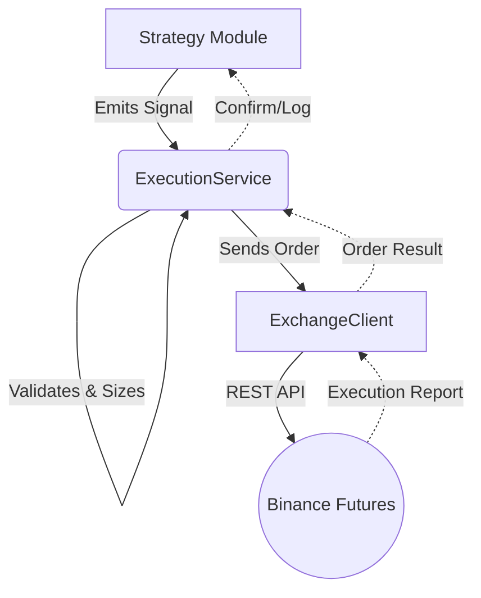

# 실행 모듈 설계 (Execution Module Design)

## 개요 (Overview)

`execution` 모듈은 `strategy` 모듈에서 생성된 매매 신호를 안정적으로 실행하는 역할을 담당합니다. 이 모듈은 추상적인 매매 신호와 구체적인 거래소 API 사이의 중개자 역할을 하며, 주문이 올바르게 접수되고, 검증되며, 기록되도록 보장합니다.

## 아키텍처 (Architecture)

실행 계층(Execution Layer)은 전략(Strategy)으로부터 주문 관리의 복잡성을 추상화합니다.

### 개념적 컴포넌트 다이어그램 (Conceptual Component Diagram)



## 데이터 구조 (Data Structures - DTOs)

### TradeSignal

전략에서 발행하는 표준화된 신호 객체입니다.

```typescript
export enum SignalType {
  Long,
  Short,
  ExitLong,
  ExitShort,
}

export interface TradeSignal {
  symbol: string; // e.g., 'BTCUSDT'
  type: SignalType;
  price?: number; // Optional limit price (if null, Market order)
  quantity?: number; // Optional specific quantity (if null, use risk manager sizing)
  reason: string; // Description for logging (e.g. "MACD Golden Cross")
}
```

## 인터페이스 정의 (Interface Definitions)

### ExecutionService

매매 실행을 위한 주요 진입점(Entry Point)입니다.

```typescript
import { TradeSignal } from './dto/trade-signal.dto';
import { Order } from '../exchange/dto/order.dto';

export interface ExecutionService {
  /**
   * Execute a trade based on a strategy signal.
   * Handles validation, risk checks (optional), and routing to the exchange.
   */
  execute(signal: TradeSignal): Promise<Order>;
}
```

## 구현 전략 (Implementation Strategy)

### 워크플로우 (Workflow)

1.  **신호 수신 (Signal Reception)**: `ExecutionService`가 `TradeSignal`을 수신합니다.
2.  **검증 (Validation)**:
    - 기존 오픈 포지션 확인 (전략이 물타기/불타기를 금지하는 경우).
    - 가용 잔고 확인 (`ExchangeClient.getBalance` 활용).
    - (향후) 리스크 규칙에 따른 포지션 크기 계산.
3.  **주문 생성 (Order Construction)**:
    - `SignalType`을 `OrderSide` (매수/매도)로 변환.
    - `OrderType` (지정가 vs 시장가) 결정.
4.  **실행 (Execution)**:
    - `ExchangeClient.createOrder()` 호출.
5.  **에러 처리 (Error Handling)**:
    - API 에러 포착 (예: "잔고 부족" - Insufficient Boundary).
    - 일시적인 네트워크 에러에 대한 재시도 로직.

### 예시 로직 (Example Logic - Pseudocode)

```typescript
async execute(signal: TradeSignal): Promise<Order> {
  // 1. Map Signal to Order Props
  const side = this.mapSignalToSide(signal.type);
  const type = signal.price ? OrderType.LIMIT : OrderType.MARKET;

  // 2. Prepare Order DTO
  const orderDto: CreateOrderDto = {
    symbol: signal.symbol,
    side: side,
    type: type,
    quantity: signal.quantity || this.defaultSize, // Pending: Smart Sizing
    price: signal.price,
  };

  // 3. Send to Exchange
  return this.exchangeClient.createOrder(orderDto);
}
```

## NestJS 통합 (NestJS Integration)

`ExecutionModule`은 `ExchangeClient`에 접근하기 위해 `ExchangeModule`을 임포트합니다.

```typescript
@Module({
  imports: [ExchangeModule],
  providers: [
    {
      provide: 'ExecutionService',
      useClass: SimpleExecutionService,
    },
  ],
  exports: ['ExecutionService'],
})
export class ExecutionModule {}
```
