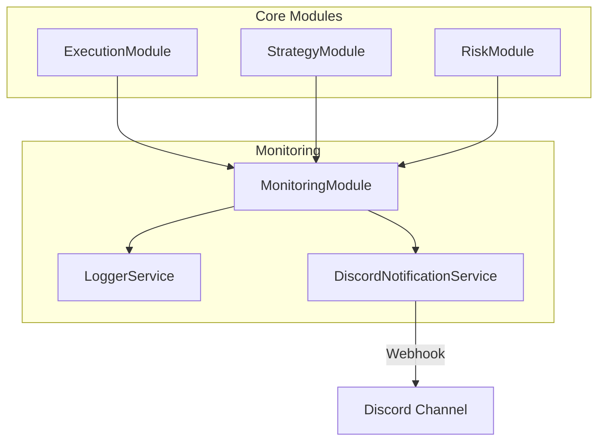

# Monitoring Module Design

## 1. 개요 (Overview)

Monitoring 모듈은 트레이딩 봇의 운영 상태, 거래 내역, 그리고 예외 상황을 실시간으로 감지하고 기록합니다. 또한, 사용자가 중요한 이벤트를 즉시 인지할 수 있도록 **디스코드(Discord) Webhook**을 통해 실시간 알림을 제공하는 것을 목표로 합니다.

## 2. 요구사항 (Requirements)

### 2.1. 시스템 로깅 (System Logging)

- 애플리케이션의 생명주기(시작, 로드, 종료) 로그 기록.
- 주요 트레이딩 이벤트(시그널 발생, 주문 요청, 체결 완료) 로그 기록.
- 에러 및 예외 상황에 대한 상세 스택 트레이스 기록.

### 2.2. 실시간 알림 (Real-time Notifications)

- **채널**: 디스코드(Discord) Webhook.
- **알림 대상 중요 이벤트**:
  - **매매 활동**: 주문 진입(Buy/Short), 청산(Sell/Cover), 익절/손절(TP/SL) 발생 시.
  - **에러**: 예기치 않은 시스템 에러, API 연결 끊김, 잔고 부족 등.
  - **시스템 상태**: 봇 시작/종료, 설정 변경 확인.

### 2.3. 유연성 및 확장성

- 알림 메시지 포맷을 구조화(Discord Embed 등)하여 가독성 확보.
- 추후 텔레그램(Telegram) 등 다른 메신저 연동이 용이하도록 인터페이스 기반 설계.

## 3. 아키텍처 (Architecture)

### 3.1. 모듈 의존성

`MonitoringModule`은 다른 모든 모듈(`Execution`, `Strategy`, `Risk`)에서 참조될 수 있는 공통 모듈 성격을 가집니다. 혹은 `CommonModule`에 포함될 수도 있으나, `Architecture.md`에 따라 독립 모듈로 구성합니다.



## 4. 상세 설계 (Detailed Design)

### 4.1. Notification Interface

알림 발송 로직의 추상화를 위해 인터페이스를 정의합니다.

```typescript
// src/monitoring/domain/notification.service.interface.ts

export interface NotificationService {
  /**
   * 일반 텍스트 메시지를 전송합니다.
   */
  sendMessage(message: string, level?: NotificationLevel): Promise<void>;

  /**
   * 거래 관련 정보를 구조화하여 전송합니다.
   */
  sendTradeAlert(tradeInfo: TradeAlertDto): Promise<void>;

  /**
   * 에러 정보를 전송합니다.
   */
  sendErrorAlert(error: Error, context?: string): Promise<void>;
}

export enum NotificationLevel {
  Info = 'INFO',
  Warn = 'WARN',
  Error = 'ERROR',
  Success = 'SUCCESS',
}
```

### 4.2. DTO (Data Transfer Objects)

알림에 필요한 데이터를 정의합니다. `any` 타입을 사용하지 않고 명확한 객체를 사용합니다.

```typescript
// src/monitoring/dto/trade-alert.dto.ts

export interface TradeAlertDto {
  symbol: string; // 거래 코인 (예: BTCUSDT)
  action: 'OPEN_LONG' | 'OPEN_SHORT' | 'CLOSE_LONG' | 'CLOSE_SHORT';
  price: number; // 체결 가격
  quantity: number; // 수량
  profit?: number; // (청산 시) 실현 손익
  strategyName?: string; // 진입한 전략 이름
  timestamp: Date;
}
```

### 4.3. Discord 구현 (Embed 활용)

디스코드의 **Embed** 기능을 사용하여 시각적으로 구분되는 알림을 보냅니다.

- **Action**: 색상(Color)으로 구분 (예: 매수-초록, 매도-빨강, 에러-검정/빨강).
- **Fields**: 가격, 수량, 시간 등을 필드로 배치.

### 4.4. Configuration

`.env` 파일에서 Webhook URL을 로드합니다.

```text
# .env
DISCORD_WEBHOOK_URL=https://discord.com/api/webhooks/123456789/abcdef...
```

## 5. 구현 계획 (Implementation Plan)

1. **설정**: `ConfigModule`에 Discord Webhook URL 유효성 검사 추가.
2. **서비스 구현**:
   - `DiscordNotificationService` 구현: `axios` 또는 `fetch`를 사용하여 Webhook POST 요청 전송.
   - `Rate Limiting` 고려: 디스코드 API 제한(초당 요청 수 등)을 고려하여 큐(Queue) 적용 또는 단순 지연 처리.
3. **통합**:
   - `GlobalExceptionFilter`에 연동하여 처리되지 않은 예외 발생 시 자동으로 알림 전송.
   - `ExecutionModule`에서 주문 체결 시 `sendTradeAlert` 호출.
