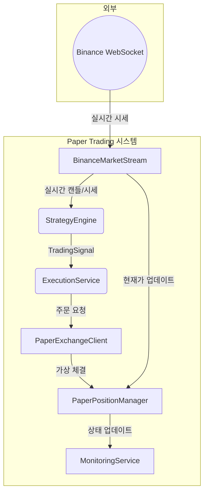
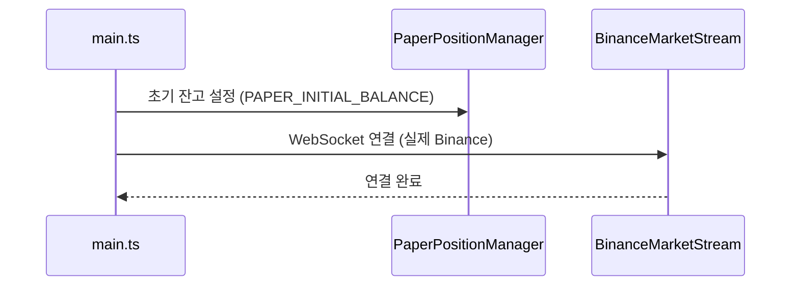
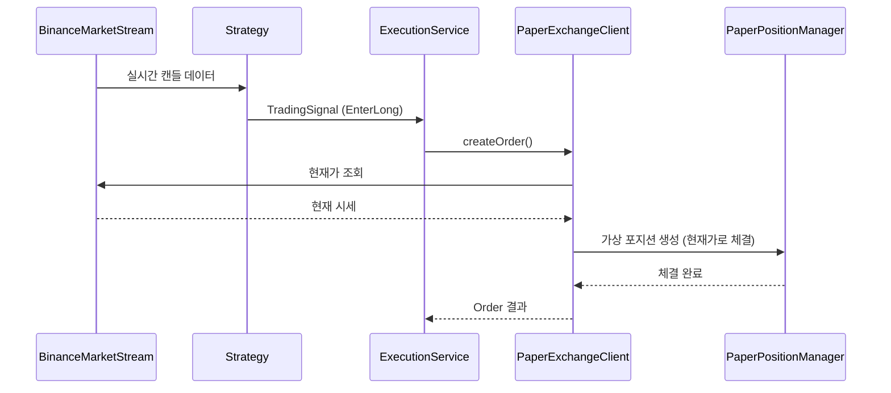

# 실시간 모의투자 테스트 설계 (Paper Trading)

## 개요 (Overview)

실시간 모의투자(Paper Trading)는 **실제 자본을 사용하지 않고** 트레이딩 전략을 검증하는 시스템입니다. **실제 시장 데이터(WebSocket)**를 기반으로 **메모리 상의 가상 포지션**을 관리하며, PnL(손익)을 계산합니다.

### 핵심 원칙

- **실제 API 호출 없음**: 주문/포지션/잔고는 모두 메모리에서 관리
- **실제 시세 사용**: WebSocket 스트림으로 실시간 가격 데이터 수신
- **기존 인터페이스 구현**: `ExchangeClient` 인터페이스를 구현하여 기존 코드와 호환

### 목표

1. **전략 검증**: 실제 배포 전 전략의 유효성을 실시간으로 확인
2. **버그 탐지**: 실행 로직의 오류를 리스크 없이 발견
3. **성능 측정**: 실시간 환경에서의 전략 성과 측정

---

## 아키텍처 (Architecture)

### 컴포넌트 다이어그램



### 핵심 컴포넌트

| 컴포넌트               | 역할                                                           |
| ---------------------- | -------------------------------------------------------------- |
| `BinanceMarketStream`  | 실제 Binance WebSocket에서 시세 데이터 수신 (기존 구현 재사용) |
| `PaperExchangeClient`  | `ExchangeClient` 인터페이스 구현, 가상 주문 처리               |
| `PaperPositionManager` | 메모리 상의 포지션/잔고/거래 기록 관리                         |

---

## 환경 구성 (Environment Configuration)

### 환경 변수

```bash
# 실행 모드 (development | production | test)
NODE_ENV=development

# 모의투자 모드 활성화
PAPER_TRADING_ENABLED=true

# 모의투자 초기 자산 (USDT)
PAPER_INITIAL_BALANCE=10000

# 거래 심볼
TRADING_SYMBOL=BTCUSDT

# 전략 타임프레임
TRADING_INTERVAL=15m
```

---

## 데이터 구조 (Data Structures)

### PaperPosition

가상 포지션을 관리하기 위한 DTO입니다.

```typescript
export interface PaperPosition {
  symbol: string;
  side: 'LONG' | 'SHORT';
  entryPrice: number;
  quantity: number;
  leverage: number;
  openTime: number;
  stopLossPrice?: number;
  takeProfitPrice?: number;
}
```

### PaperTrade

체결된 가상 거래 기록입니다.

```typescript
export interface PaperTrade {
  id: string;
  symbol: string;
  side: 'LONG' | 'SHORT';
  entryPrice: number;
  exitPrice: number;
  quantity: number;
  pnl: number;
  pnlPercent: number;
  openTime: number;
  closeTime: number;
  reason: string;
}
```

### PaperPortfolio

전체 포트폴리오 상태입니다.

```typescript
export interface PaperPortfolio {
  initialBalance: number;
  currentBalance: number;
  totalPnl: number;
  totalPnlPercent: number;
  openPositions: PaperPosition[];
  closedTrades: PaperTrade[];
}
```

---

## 인터페이스 정의 (Interfaces)

### PaperExchangeClient

`ExchangeClient` 인터페이스를 구현하여 가상 거래를 처리합니다.

```typescript
export interface PaperExchangeClientConfig {
  initialBalance: number;
  slippagePercent?: number; // 기본값: 0.1%
  feePercent?: number; // 기본값: 0.04%
}
```

### 구현 전략

1. **ExchangeClient 인터페이스 구현**: 기존 `BinanceExchangeClient`와 동일한 인터페이스
2. **메모리 기반 상태 관리**: 포지션, 잔고, 거래 기록을 메모리에 저장
3. **현재가 참조**: `MarketStream`에서 실시간 가격을 받아 체결가로 사용
4. **수수료 적용**: Binance 기본 수수료율(0.04% Maker/Taker) 적용

### ExchangeClient 인터페이스 매핑

| 메서드              | Paper Trading 구현                               |
| ------------------- | ------------------------------------------------ |
| `createOrder()`     | 메모리에 가상 포지션 생성, 현재 시세로 즉시 체결 |
| `cancelOrder()`     | 메모리에서 주문 제거                             |
| `getPositions()`    | 메모리의 오픈 포지션 반환                        |
| `getBalance()`      | 메모리의 가상 잔고 반환                          |
| `getTradeHistory()` | 메모리의 거래 기록 반환                          |

---

## 모듈 구조 (Module Structure)

### 디렉토리 구조

```text
📂 src/paper-trading
├── 📂 domain
│   ├── paper-position.ts
│   ├── paper-trade.ts
│   └── paper-portfolio.ts
├── 📂 application
│   ├── paper.exchange.client.ts
│   ├── paper.exchange.client.spec.ts
│   ├── paper.position.manager.ts
│   └── paper.position.manager.spec.ts
├── paper-trading.module.ts
└── paper-trading.config.ts
```

### NestJS 통합

```typescript
@Module({
  imports: [ConfigModule, ExchangeModule],
  providers: [
    PaperPositionManager,
    {
      provide: 'ExchangeClient',
      inject: [ConfigService, PaperPositionManager, 'MarketStream'],
      useFactory: (
        config: ConfigService,
        paperManager: PaperPositionManager,
        marketStream: MarketStream,
      ) => {
        const isPaperMode = config.get('PAPER_TRADING_ENABLED') === 'true';
        if (isPaperMode) {
          return new PaperExchangeClient(paperManager, marketStream, {
            initialBalance: Number(config.get('PAPER_INITIAL_BALANCE')),
          });
        }
        return new BinanceExchangeClient(config);
      },
    },
  ],
  exports: ['ExchangeClient'],
})
export class PaperTradingModule {}
```

---

## 실행 흐름 (Workflow)

### 1. 초기화



### 2. 신호 처리 및 가상 체결



### 3. 포지션 종료 및 PnL 계산

```typescript
// PnL 계산 로직
function calculatePnl(
  position: PaperPosition,
  exitPrice: number,
  feePercent: number,
): number {
  const priceDiff =
    position.side === 'LONG'
      ? exitPrice - position.entryPrice
      : position.entryPrice - exitPrice;

  const grossPnl = priceDiff * position.quantity;
  const fee = exitPrice * position.quantity * feePercent;

  return grossPnl - fee;
}
```

---

## 테스트 전략 (Testing Strategy)

### 단위 테스트 (Jest)

```typescript
describe('PaperExchangeClient', () => {
  it('should create a virtual long position', () => {});
  it('should calculate PnL correctly on position close', () => {});
  it('should deduct fees from realized PnL', () => {});
  it('should track balance changes accurately', () => {});
  it('should use current market price for order execution', () => {});
});

describe('PaperPositionManager', () => {
  it('should initialize with given balance', () => {});
  it('should open position and deduct margin from balance', () => {});
  it('should close position and update balance with PnL', () => {});
  it('should not allow position if insufficient balance', () => {});
  it('should track trade history', () => {});
});
```

### 통합 테스트

```typescript
describe('Paper Trading E2E', () => {
  it('should execute full trade cycle with real market stream', () => {});
  it('should update Discord with paper trade notifications', () => {});
});
```

---

## 실행 방법 (How to Run)

### 개발 모드 실행

```bash
# 환경변수 설정 후 실행
NODE_ENV=development PAPER_TRADING_ENABLED=true pnpm run start:dev
```

### 전용 스크립트

`package.json`에 추가:

```json
{
  "scripts": {
    "paper:start": "NODE_ENV=development PAPER_TRADING_ENABLED=true nest start --watch"
  }
}
```

---

## 모니터링 및 리포트 (Monitoring & Reports)

### 실시간 로그

```text
[PaperTrading] 📈 LONG 진입: BTCUSDT @ 42,500.00 (수량: 0.1)
[PaperTrading] 🎯 익절 체결: +2.5% (+$106.25)
[PaperTrading] 💰 현재 잔고: $10,106.25 (총 수익률: +1.06%)
```

### Discord 알림

기존 `DiscordNotificationService`를 활용하여 Paper Trading 이벤트도 알림:

- 포지션 진입/청산
- 일일 성과 리포트
- 중요 마일스톤 (예: 최대 손실 도달)

---

## 구현 우선순위

1. **[P0]** `PaperPosition`, `PaperTrade`, `PaperPortfolio` DTO 정의
2. **[P0]** `PaperPositionManager` 구현 (포지션 생성/종료/PnL 계산/잔고 관리)
3. **[P1]** `PaperExchangeClient` 구현 (`ExchangeClient` 인터페이스 구현)
4. **[P1]** `MarketStream` 연동하여 현재가 참조
5. **[P2]** 실시간 로깅 및 Discord 알림 연동
6. **[P2]** 일일 성과 리포트 생성기
