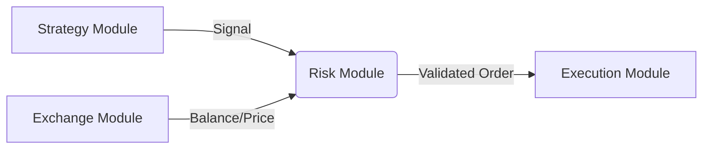

# Risk Management Module Design

## 개요 (Overview)

`Risk` 모듈은 트레이딩 봇의 안전장치 역할을 수행합니다. 전략(Strategy)이 생성한 매매 신호를 받아, 현재 자산 상태와 리스크 규칙에 부합하는지 검증하고, 최종적인 주문 크기(Position Size)와 손절/익절가(Stop Loss / Take Profit)를 산출합니다.

이 모듈의 핵심 목표는 **파산 방지(Capital Preservation)**와 **손익비 최적화(Risk-Reward Optimization)**입니다.

## 아키텍처 (Architecture)

리스크 모듈은 Strategy 모듈과 Execution 모듈 사이에 위치합니다.



### 주요 책임 (Core Responsibilities)

1.  **포지션 사이징 (Position Sizing)**: 계좌 잔고와 리스크 허용치(Risk per Trade)를 기반으로 진입 물량을 계산합니다.
2.  **리스크 검증 (Risk Validation)**: 하루 최대 손실 한도, 레버리지 제한 등 사전 정의된 규칙 위반 여부를 체크합니다.
3.  **TP/SL 설정 (Target & Stop Calculation)**: 전략에서 제시한 값 혹은 변동성(ATR) 기반으로 동적인 익절/손절가를 설정합니다.

## 데이터 구조 (Data Structures)

명확한 타입 정의를 위해 DTO를 사용합니다.

### RiskConfig (설정값)

```typescript
export interface RiskConfig {
  maxDailyLossPercent: number; // 일일 최대 손실률 (예: 2%)
  maxLeverage: number; // 최대 레버리지 (예: 5x)
  riskPerTradePercent: number; // 트레이드 당 리스크 비율 (예: 1%)
  rewardToRiskRatio: number; // 최소 손익비 (예: 1.5)
}
```

### OrderRequest (계산된 주문 정보)

```typescript
export enum OrderSide {
  Buy,
  Sell,
}

export interface OrderRequest {
  symbol: string;
  side: OrderSide;
  quantity: number; // 계산된 진입 수량
  entryPrice: number; // 예상 진입가
  stopLossPrice: number; // 확정된 손절가
  takeProfitPrice: number; // 확정된 익절가
  leverage: number; // 적용 레버리지
}
```

## 인터페이스 정의 (Interface Definitions)

### RiskManager

외부 모듈(Strategy)이 호출하는 메인 인터페이스입니다.

```typescript
import { TradeSignal } from '../strategy/strategy.interface'; // 가정
import { AccountBalance } from '../exchange/exchange.interface'; // 가정

export interface RiskManager {
  /**
   * 시그널과 현재 자산 정보를 받아 최종 주문 정보를 생성합니다.
   * 리스크 검증 실패 시 에러를 던지거나 null을 반환할 수 있습니다.
   */
  evaluate(signal: TradeSignal, balance: AccountBalance): Promise<OrderRequest>;
}
```

### PositionSizer (포지션 크기 계산기)

```typescript
export interface PositionSizer {
  /**
   * 계좌 잔고와 손절 폭을 기준으로 진입 수량을 계산합니다.
   * 공식: (AccountEquity * RiskPerTrade) / |Entry - StopLoss|
   */
  calculateSize(
    equity: number,
    entryPrice: number,
    stopLossPrice: number,
  ): number;
}
```

## 구현 전략 (Implementation Strategy)

### 1단계: 정적 리스크 관리 (Static Risk Management)

초기 단계에서는 고정된 비율의 리스크 관리 로직을 구현합니다.

- **고정 리스크**: 트레이드 당 자산의 1% 손실 허용.
- **고정 레버리지**: 사전에 설정된 레버리지(예: 1x, 5x) 사용.

### 2단계: 동적 리스크 관리 (Dynamic Risk Management)

이후 고도화 단계에서 변동성을 고려한 로직을 추가합니다.

- **ATR 기반 SL**: 시장 변동성에 따라 손절 폭 조절.
- **켈리 공식(Kelly Criterion)**: 승률과 손익비를 고려한 베팅 비율 조절.

## 예외 처리 (Error Handling)

- **자금 부족 (Insufficient Funds)**: 계산된 주문 금액이 가용 자산을 초과하면 즉시 거부(Reject).
- **최대 손실 도달 (Max Loss Reached)**: 일일 허용 손실 초과 시 당일 매매 중단 신호 발생.
